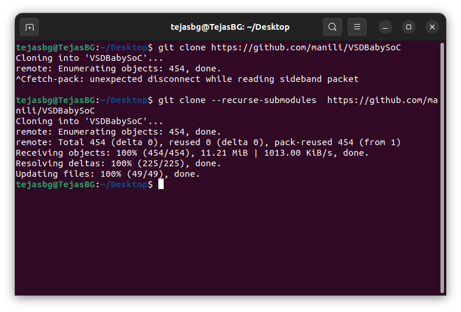
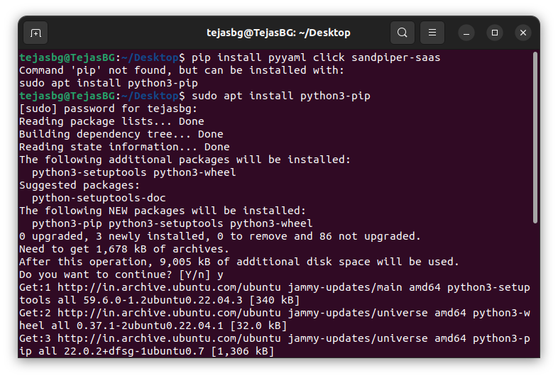

# Task-1 : BabySoC Fundamentals


## 🧩 1. Understanding System-on-Chip (SoC)

A **System-on-Chip (SoC)** is essentially a miniature computer built onto a single silicon chip.  
It integrates all the key components required for computation, communication, and control — making it compact, efficient, and highly power-optimized.

For example, in a **traditional computer**, we have a **central CPU core** (from Intel or AMD) mounted on a **motherboard**.  
The motherboard houses all the necessary circuitry and components required for the CPU to function properly — such as timers, counters, interrupt controllers, RAM, code memory, HDD interface, clock generators, frequency dividers, I/O controllers, peripheral interfaces, and various protocol handlers.  


<div align="center">
  
  <p><b>Different Components of a typical Mother Board</b></p>
</div>

<br>

This setup is **modular and repairable**, meaning any faulty part (like RAM or storage) can be replaced independently.  
However, it also **occupies more space** and **consumes more power**, since all components are placed on a large PCB and connected through external buses.

In contrast, an **SoC** (like Apple’s *M-series chips*) integrates all these components — the **CPU core, memory, clocking circuits, I/O interfaces, and peripherals** — onto a **single silicon wafer**.  
This drastically **reduces area and power consumption**, making SoCs ideal for **portable and low-power devices** such as smartphones, tablets, and wearables. 

<div align="center">
  
  <p><b>Apple's M1 SoC Chip</b></p>
</div>

<br>

The trade-off, however, is **repairability** — since everything is fabricated together, replacing or upgrading a single component isn’t possible.  


### ✳️ Key Components of a typical SoC
- **CPU (Central Processing Unit):**  
  Acts as the brain of the system, executing instructions and managing all operations.  

- **Memory:**  
  - **RAM** for temporary data storage during operation/runtime. 
  - **ROM/Flash** for permanent data storage.  

- **I/O Interfaces:**  
  Enable communication with external peripherals like sensors, displays, or network interfaces.  

- **GPU (Graphics Processing Unit):**  
  Handles image and video rendering.  

- **DSP (Digital Signal Processor):**  
  Specializes in audio, video, and signal processing tasks.  

- **Power Management Unit (PMU):**  
  Controls energy distribution to ensure efficiency and longer battery life.  

- **Connectivity Modules (Wi-Fi, Bluetooth, etc.):**  
  Enable wireless communication and data transfer.  

### 💡 Advantages of SoC
- Compact and space-saving.  
- Lower power consumption.  
- Improved processing speed due to shorter data paths.  
- Cost-effective and reliable with fewer interconnections.  

### 📱 Applications
Used in smartphones, IoT devices, wearables, automotive systems, and embedded applications and nowadays even in laptops. 

---

## 🧱 2. Types of SoCs
1. **Microcontroller-based SoC:**  
   Designed for simple, low-power control applications like home appliances or IoT systems.  

2. **Microprocessor-based SoC:**  
   Designed for higher computational needs — found in smartphones and tablets.  

3. **Application-Specific SoC (ASIC-based):**  
   Custom-built for particular applications like AI accelerators, GPUs, or networking hardware.  

---

## 🧭 3. Introduction to VSDBabySoC  

**VSDBabySoC** is a simplified yet powerful RISC-V based SoC, created for educational and open-source experimentation.  

<div align="center">
  
  <p><b>VSD Baby SoC Block Diagram</b></p>
</div>
<br>


### 🧠 Core Components  
- **RVMYTH Processor (RISC-V CPU):**  
  The main processing unit that handles instruction execution. Learn more about RVMYTH [here](https://github.com/kunalg123/rvmyth)

- **Phase-Locked Loop (PLL):**  
  Generates a stable and synchronized clock for all modules.  

- **10-bit Digital-to-Analog Converter (DAC):**  
  Converts digital data from RVMYTH into analog signals for external output (e.g., sound/video).  

### ⚡ Internal Operation  
1. **Initialization & Clock Generation:**  
   The PLL locks onto an input reference and produces a stable system clock.  

2. **Data Processing in RVMYTH:**  
   The CPU processes data and writes values to the DAC input register.  

3. **Analog Signal Generation via DAC:**  
   The DAC converts the processed digital values into analog signals, enabling BabySoC to interface with real-world devices such as TVs or speakers.  

---


## 🪄 4. Key Analog IPs in BabySoC  

### 🕒 Phase-Locked Loop (PLL)

<div align="center">
  
  <p><b>Basic block diagram of a PLL</b></p>
</div>
<br>

- Maintains phase and frequency alignment with a reference clock.  
- Consists of:  
  - **Phase Detector**  
  - **Loop Filter**  
  - **Voltage-Controlled Oscillator (VCO)**
  - **Frequency Divider**
- Ensures synchronized operation across digital and analog modules.  

**Why internal PLL is preferred over off-chip clocks:**  
- Reduces distribution delay and clock jitter.  
- Provides multiple frequency domains for different SoC blocks.  
- Maintains timing accuracy despite environmental variations.  

### 🎚️ Digital-to-Analog Converter (DAC)

<div align="center">
  
  <p><b>An R2R Ladder DAC</b></p>
</div>
<br>

- Converts digital binary values into continuous analog voltages
- Two major hardware implementations:
  1. **Weighted Resistor DAC**
  2. **R-2R Ladder DAC**  
- In BabySoC, we use a **behavioral model** of a 10-bit DAC that mathematically converts the RVMYTH processor's digital output to analog voltages using Verilog's `real` data type, rather than modeling actual resistor networks.
---

## 📘 6. Why BabySoC Matters  
VSDBabySoC serves as an excellent educational and research platform because:  
- It integrates **digital (RISC-V)** and **analog (PLL & DAC)** components.  
- Provides a **complete SoC workflow** — from functional modelling to physical implementation.  
- Encourages learning open-source EDA tools and Sky130 technology.  
- Builds a foundation for **digital-analog interfacing and RISC-V system design**.
- Easier to analyse as there are less number of IPs, very student friendly.

To Know more about Baby SoC [click here](https://github.com/manili/VSDBabySoC)

---

# Task-2: BabySoC Functional Modeling

## Steps Involved:
To simulate BabySoC, follow these steps:

1. **Clone the repository**: Use `git clone https://github.com/manili/VSDBabySoC` - contains all required Verilog & testbench files
2. **Install tools**: Icarus Verilog & GTKWave ([guide here](https://github.com/tejasbg19/India_riscV_SoC_tapeout) if not installed)
3. **Setup Python environment**: Install pip and Python virtual environment
4. **Install SandPiper**: For TL-Verilog to Verilog conversion (rvmyth.tlv → rvmyth.v)
5. **Compile & simulate**: Use Icarus Verilog to compile and run the testbench
6. **Analyze results**: View and analyze waveforms using GTKWave

```bash
$ git clone --recurse-submodules https://github.com/manili/VSDBabySoC
$ sudo apt install python3-pip
$ sudo apt install python3-venv python3-pip
$ cd VSDBabySoC
$ python3 -m venv Tejas    #create virtual environment
$ source Tejas/bin/activate   #activate the environment
$ sandpiper-saas -i ./src/module/*.tlv -o rvmyth.v --bestsv --noline -p verilog --outdir ./src/module/     # Convert Traction Level Verilog file of rvmyth core into Verilog
$ iverilog -DPRE_SYNTH_SIM -I src/include -I src/module src/module/testbench.v     # Compile all the necessary verilog files
$ ./a.out # or vvp a.out   # Simulate the test bench
$ gtkwave pre_synth_sim.vcd     # Open the waveform
```


<div align="center">
  
  <p><b>Cloning the Repository</b></p>
</div>
<br>

<div align="center">
  
  <p><b>Installing pip3</b></p>
</div>
<br>

<div align="center">
  
  <p><b>Installing py virtual environment</b></p>
</div>
<br>

<div align="center">
  
  <p><b>Converting TLV file into Verilog file using sandpiper compiler</b></p>
</div>
<br>

<div align="center">
  
  <p><b>Thus Generated Verilog file</b></p>
</div>
<br>

<div align="center">
  
  <p><b>Compilation, Simulation & opening the waveform</b></p>
</div>
<br>

---

## Analysis of Each Module & Waveform

## The RISC-V Core: rvmyth.v

**Module Purpose**: 5-stage pipelined RISC-V CPU core that executes the arithmetic program and outputs results to DAC.

**Key Features**:
- **5-stage pipeline**: Fetch (@0-1), Decode (@1-2), Execute (@3), Memory (@4), Writeback (@5)
- **RV32I Instruction Set**: Supports arithmetic, branch, load/store, and jump instructions
- **Register File**: 32 registers with write-back forwarding
- **Program Memory**: Hardcoded instruction sequence for arithmetic operations

**Critical Signals**:
- `CLK`, `reset` - System clock and reset
- `OUT[9:0]` - 10-bit output to DAC (from register r17)
- `CPU_pc_a*` - Program counter at each pipeline stage
- `CPU_Xreg_value_a5[17]` - Register r17 final value (DAC input)
- Pipeline control: `valid_taken_br`, `valid_load`, `valid_jump`

**Waveform Analysis Points**:
- Pipeline progression through stages
- Register r17 value changes during computation
- Branch instruction execution and PC updates
- Final output stabilization to DAC

## The PLL: avsdpll.v

**Module Purpose**: Behavioral Phase-Locked Loop that generates system clock from reference input.

**Key Features**:
- **Frequency Multiplication**: 8× multiplication (5MHz REF → 40MHz CLK)
- **Behavioral Model**: Uses real-number timing for simulation
- **Clock Gating**: `ENb_VCO` enables/disables clock generation

**Critical Signals**:
- `REF` - Reference clock input (5MHz in testbench)
- `CLK` - Generated system clock output (40MHz)
- `ENb_VCO` - VCO enable (active low)
- `VCO_IN`, `ENb_CP` - Unused in behavioral model

**Operation**:
- Measures REF period using `$realtime`
- Calculates CLK period: `period = refpd / 8.0`
- Self-triggering oscillator with dynamic period adjustment
- Models PLL locking behavior without analog components

**Waveform Analysis Points**:
- REF to CLK frequency relationship (8:1 ratio)
- PLL locking behavior over time
- Clock enable/disable transitions

## The DAC: avsddac.v

**Module Purpose**: 10-bit Digital-to-Analog Converter behavioral model.

**Key Features**:
- **10-bit Resolution**: Converts 0-1023 digital values to analog voltage
- **Behavioral Modeling**: Uses Verilog `real` data type for analog simulation
- **Voltage Range**: Maps to VREFL-VREFH (0V-3.3V in testbench)

**Critical Signals**:
- `D[9:0]` - 10-bit digital input from RISC-V core
- `OUT` - Analog voltage output (real number)
- `VREFH`, `VREFL` - Reference voltages (3.3V, 0V)
- `EN` - Always enabled in current implementation

**Conversion Formula**:
```verilog
OUT <= VREFL + ($itor(Dext) / 1023.0) * (VREFH - VREFL)
```

Where `Dext = {1'b0, D}` (unsigned 11-bit extended)

**Waveform Analysis Points**:
- Digital input (D) to analog output (OUT) mapping
- Voltage range verification (0V to 3.3V)
- Step response to CPU output changes

## The SoC Integration: vsdbabysoc.v

**Module Purpose**: Top-level System-on-Chip that integrates all components.

**Signal Flow**:
`REF → PLL → CLK → RISC-V CPU → RV_TO_DAC[9:0] → DAC → OUT`

**Inter-module Connections**:
- PLL provides synchronized clock to CPU
- CPU digital output feeds DAC input  
- DAC produces final analog output
- Control signals (reset, enables) propagate through hierarchy

**Waveform Analysis Points**:
- End-to-end signal propagation
- Clock domain synchronization
- Digital-to-analog conversion chain
- System-level timing relationships
